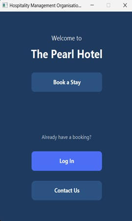
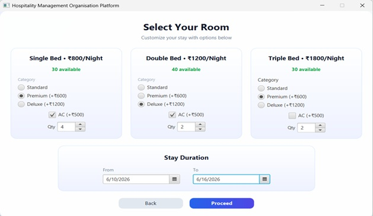
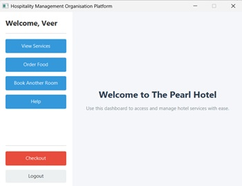

# 🏨 Hotel Management Platform

A desktop-based Hotel Management System developed using **Java, JavaFX, JDBC, and PostgreSQL**. The application automates hotel reservation and room management operations by allowing customers to register, authenticate, book rooms, manage reservations, access hotel services, and view booking details through an intuitive graphical interface.

---

## ✨ Features

* User Registration and Authentication
* Secure Login System using Booking ID, Phone Number, and Password
* Room Availability Management
* Multi-Room Booking Support
* Automatic Room Allocation
* Booking Summary Generation with Cost Calculation
* Customer Dashboard for Viewing Reservation Details
* Room Checkout Functionality with Automatic Room Release
* Food Ordering Service
* Laundry Scheduling Service
* Customer Support / Help Desk
* PostgreSQL Database Integration using JDBC
* Real-Time Room Inventory Updates
* Reservation Status Tracking

---

## 🛠️ Technology Stack

| Component             | Technology    |
| --------------------- | ------------- |
| Programming Language  | Java          |
| User Interface        | JavaFX, FXML  |
| Database              | PostgreSQL    |
| Database Connectivity | JDBC          |
| Build Tool            | Maven         |
| Version Control       | Git           |
| IDE                   | IntelliJ IDEA |

---

## 📂 Project Structure

```text
src/
└── main/
    ├── java/
    │   └── com/example/hotel/
    └── resources/
        └── com/example/hotel/

pom.xml
README.md
```

---

## 🗄️ Database Design

The application uses PostgreSQL as the backend database and consists of three primary tables:

### Bookings

Stores customer reservation details including:

* Booking ID
* Customer Information
* Check-in and Check-out Dates
* Booking Status

### Rooms

Stores hotel room inventory:

* Room Number
* Room Type
* Availability Status

### Booked_Rooms

Maintains the relationship between bookings and allocated rooms.

---

## 📸 Application Screenshots

## 📸 Application Screenshots

### Home Screen

<p align="center">
  
</p>

### Room Selection

<p align="center">
  
</p>

### Dashboard

<p align="center">
  
</p>

### Guest Details

<p align="center">
  
</p>
## 🚀 How to Run

### Prerequisites

* Java 21
* PostgreSQL
* Maven

### Configure Database

Update the PostgreSQL credentials in:

```java
Database.java
```

```java
private static final String URL =
        "jdbc:postgresql://localhost:5432/hotel_db";

private static final String USER = "postgres";

private static final String PASSWORD = "your_password";
```

### Build the Project

```bash
mvn clean install
```

### Run the Application

```bash
mvn javafx:run
```

---

## 🔮 Future Enhancements

* Online Payment Gateway Integration
* Email and SMS Notifications
* Real-Time Analytics and Reporting
* Cloud Database Deployment
* Customer Feedback and Rating System
* Dynamic Pricing System
* Integration with External Booking Platforms

---

## 📄 Project Report

A detailed project report containing Application Screenshots, PostgreSQL Testing Queries, Database Design and other details is available in the repository as 'Hotel Management Platform Report'


